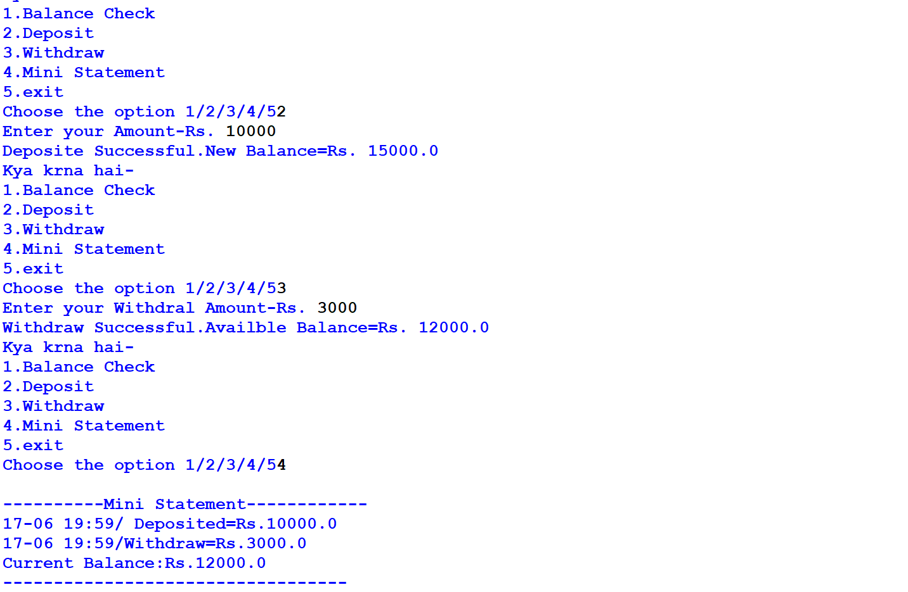

# 🏧 ATM Simulator in Python

A simple Python based ATM Simulator with PIN authentication.

## Features
- PIN verification with 3 attempts
- Check Balance
- Deposit Money
- Withdraw Money  
- Mini Statement

## How to Run
1. Clone this repo
2. Run: python "ATM Simulator.py.py"
3. Enter PIN: 1234

## 📸 Output Screenshots

### 1. Wrong PIN Attempt - Security Feature

### 2. Successful Login & Initial Balance - Rs. 5000

### 3. Deposit Rs. 10000

### 4. Withdraw Rs. 3000  

### 5. Final Mini Statement

---
Made with ❤️ by Payal
